<h1 align="center">NFT Transaction</h1>

This is the user manual for NFT transaction on personal computer.
Here are five steps listed for you to complete the cross-chain transaction on [Poly Bridge](https://bridge.poly.network/).
For your better understand, we take the NFT transaction between **Bytom** and **BSC** on [Poly Bridge](https://bridge.poly.network/) as an example.

At the very first beginning, make sure you have entered [NFT Asset](https://bridge.poly.network/testnet/nft) of Poly Bridge and seen page as below:
 
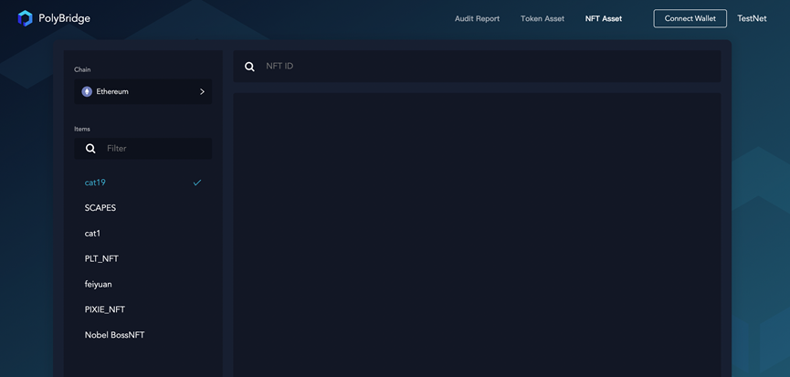 

You can start your transaction journey in this page mow!

### Step 1. Wallet connection on source chain
Firstly, you should **connect your wallet** according to your needs, e.g., Bytom on MetaMask, by following the three steps shown in below:
   

### Step 2. Chain selection
Then, **select chain and network** according to the wallet you have chosen. 
Make sure your wallet has switched to the **same network** as the chain you select now in this page.
   
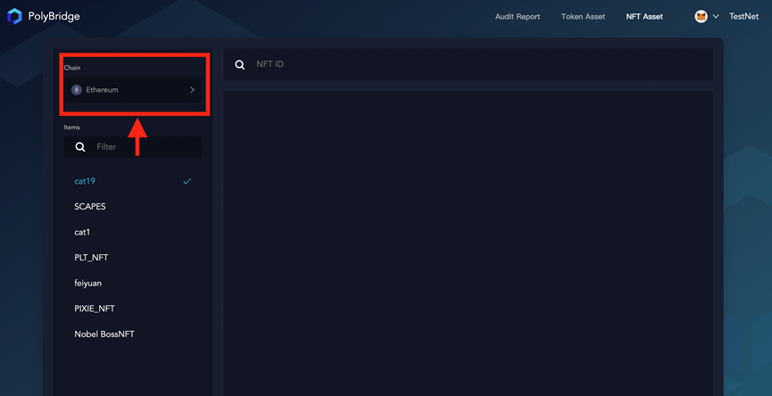
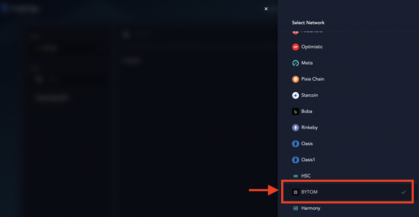

> [!Note ]
**All existing NFT assets** will be shown before your wallet is connected or switched to the appropriate chain, as shown in this figure.
   
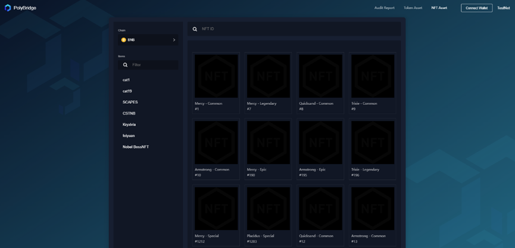

> And a window will pop up to suggest you **connecting your wallet** of this chain when you click any NFT assets on it, 
> as shown in here: 
  
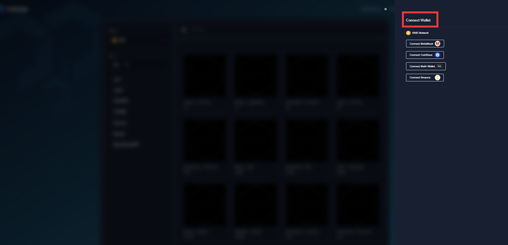

### Step 3. NFT selection
**Click the NFT project**, and you'll see all the assets contained in your wallet. 
Now **select a NFT asset**, e.g., #0.
   

### Step 4. Wallet connection on target chain
Next, click **CONNECT WALLET** and connect the wallet on **target chain**, e.g., BNB, as shown in below, and connect your target wallet:
   
   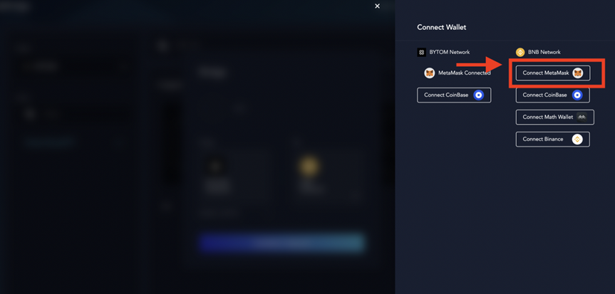

### Step 5. Transaction submission
Now you should click **APPROVE** and confirm in your wallet to authorize Poly for this NFT.
   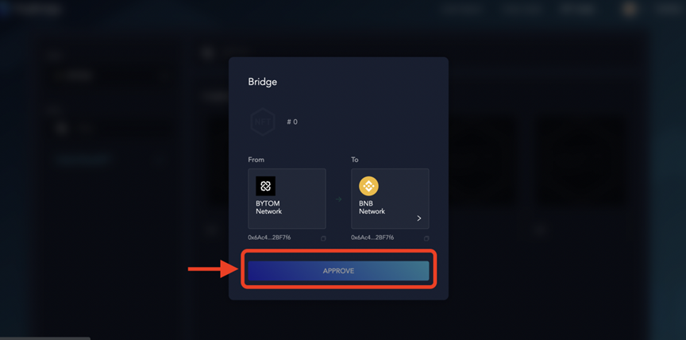

After authorization and confirmation, you can click **NEXT** to proceed. 
Confirm the core information including the **two chains** and **transaction fee**, and then click **CONFIRM** in the pop-window. 
   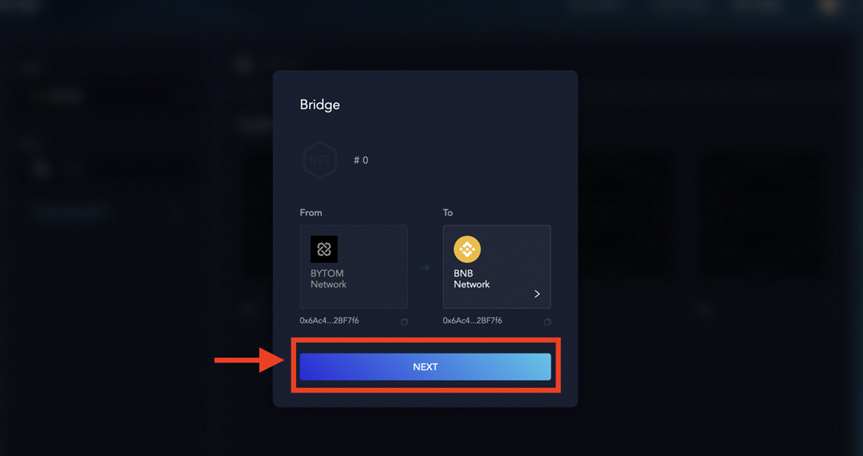
   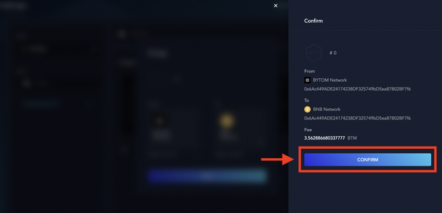

> [!Note]
> The **Fee** collected by Poly shown in this page is used to cover the transaction fee on target chain.

During the transaction, you can click on the **transaction hash** to open it in the [Poly Network](https://explorer.poly.network) to check its status. 
Wait for several minutes, and you can check your transaction in **History**.
   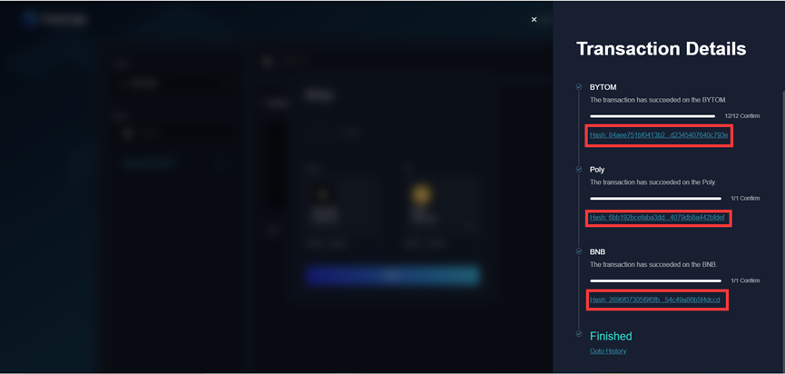
   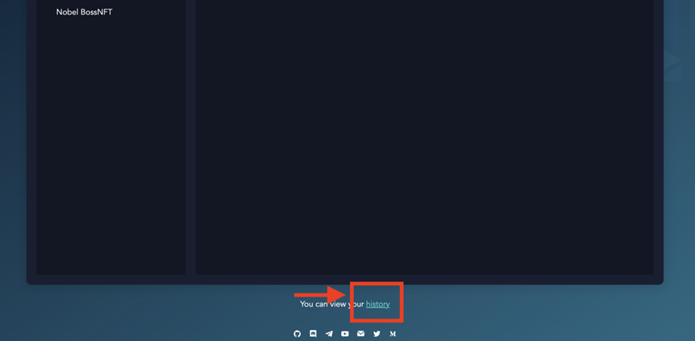

Congratulations! Till now, you've successfully completed your NFT transaction, and you can continue your cross-chain journey!
 

