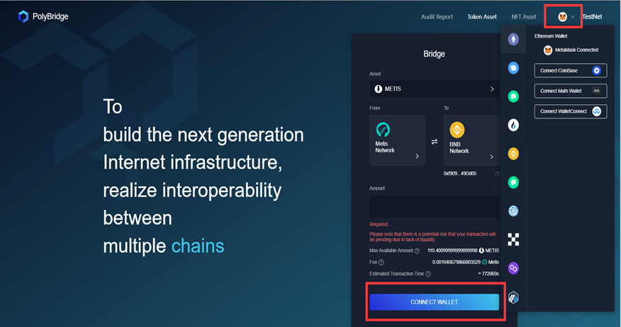
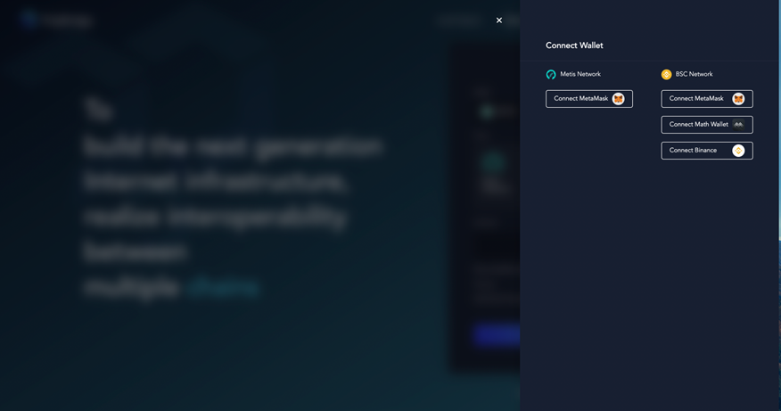
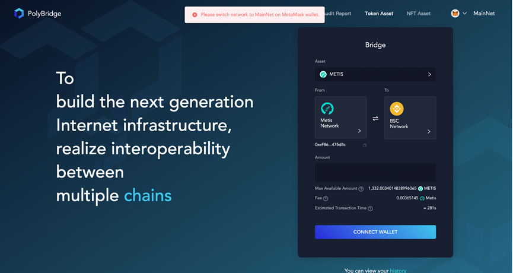
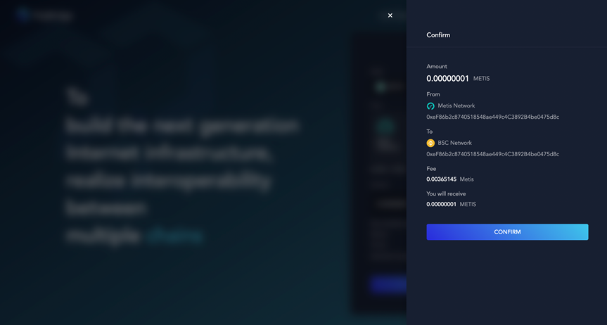

<h1 align="center">Token Transaction</h1>

This is the user manual for token transactions on personal computers. 
Here are five steps listed to complete the cross-chain transaction on [Poly Bridge](https://bridge.poly.network/).
We take the token transaction between Metis and BSC on Poly Bridge as an example for your better understanding.

At the very beginning, make sure you have entered [Token Asset](https://bridge.poly.network/testnet/) of Poly Bridge.

### Step 1. Asset selection

Firstly, you need to select the token you want to transfer. 
As shown in the figures, click Asset, then you can choose the token in the pop window.

### Step 2. Network selection

After asset selection, click **From Network**, and select the source network containing the chosen token in the pop window. 
Select the target network in the same way. 

> [!Note|style:flat|label:Notice]
> The optional network shown in this figure is the network types supported by the Metis token. Please choose it according to the actual situation.

Here the figure indicates that Metis token will be sent from Metis to the target network BSC.

### Step 3. Wallet connection

The next step is to connect the wallet. 
You can click **Connect Wallet** or the **wallet icon** to connect your wallet.  
The difference is that clicking **Connect Wallet** will enable you to select wallets both on the source and target network, as shown in the latter figure.

> [!Note|style:flat|label:Notice]
Different networks support different wallets, and the current support status is shown in the table.

| **Network**             | 	**Wallet**           |
|-------------------------|-----------------------|
| ETH	                    | Metamask/Math         |
| BSC	                    | Metamask/Binance/Math |
| HECO/OK/Polygon/Metis   | Metamask              |
| Neo	                    | Metis/Neoline         |
| Ontology                | 	Cyano                |

> [!Note|style:flat|label:Notice]
> If the warning "**Please switch network**" appears, you should switch the network of wallet to keep consistent with the source network.

### Step 4.	Transaction submission

Enter the amount you plan to swap, then click **Next**. 
A pop window will appear to show the details of the transaction. 
Please check it carefully. 

If you make sure the transaction information is correct， you can click **Confirm** to submit the transaction and confirm it again.

> [!Note|style:flat|label:Notice]
> If this is your first swap, an approval operation is required before transaction submission. 
> Approve Infinity or not depends on your actual situation.

### Step 5. Transaction checking

After the submission, you can view the transaction result in **History**. 
When the transaction details are displayed in the figure, the transaction has been completed.

Congratulations! Till now, you've completed your token transaction, and you can continue your cross-chain journey!

