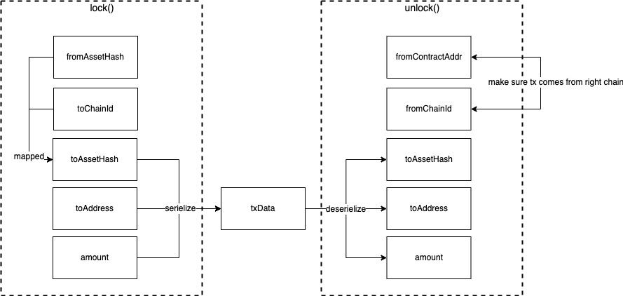

<h1 align="center">Example of Business Logic Smart Contract</h1>

This part provides an example of business logic smart contract, which provides a method to cross-chain transfer token between two chains where already equipped with Cross-Chain Manager Contract and other required contracts mentioned above. Here Chain A and B are still represent the source chain and target chain.

## LockProxy.sol

### Bind assets:

Besides of the verifying the existence of transaction through CCM contract, lock proxy contract needs to make sure of the accuracy of the transaction. The binded mapping relationship which stored in lock proxy contract will help provide the completeness of transaction data. Bind actions also prevent the wrong input from users which may lead to transfer assets to wrong asset contract address.

```solidity
pragma solidity ^0.5.0;

import "./../../libs/ownership/Ownable.sol";

contract LockProxy is Ownable {
		address public managerProxyContract;
    mapping(uint64 => bytes) public proxyHashMap;
    mapping(address => mapping(uint64 => bytes)) public assetHashMap;
    
    // ethCCMProxyAddr: the address of cross chain manager proxy contract on source chain           
    function setManagerProxy(address ethCCMProxyAddr) onlyOwner public {
        managerProxyContract = ethCCMProxyAddr;
        emit SetManagerProxyEvent(managerProxyContract);
    }
    
    // toChainId: the target chain id
    // targetProxyHash: the address of cross chain manager proxy contract on target chain
    function bindProxyHash(uint64 toChainId, bytes memory targetProxyHash) onlyOwner public returns (bool) {
        proxyHashMap[toChainId] = targetProxyHash;
        emit BindProxyEvent(toChainId, targetProxyHash);
        return true;
    }
    
    // fromAssetHash: asset hash on source chain 
    // toAssetHash: asset hash on target chain
    function bindAssetHash(address fromAssetHash, uint64 toChainId, bytes memory toAssetHash) onlyOwner public returns (bool) {
        assetHashMap[fromAssetHash][toChainId] = toAssetHash;
        emit BindAssetEvent(fromAssetHash, toChainId, toAssetHash, getBalanceFor(fromAssetHash));
        return true;
    }
}
```

- Since cross-chain transaction processed by Cross-Chain Manager (CCM) Contract, user not only needs to set Cross-Chain Manager Proxy (CCMP) address on source chain, which works as the proxy of CCM contract, but also needs to bind CCMP contract on target chain to LockProxy contract. 
- Both on Chain A and B, the user needs to bind the asset contract to LockProxy smart contract and the target chain id (here for Chain A, Chain B is the target chain), so that the LockProxy contract can maintain mappings(making connections) from asset contract address on source chain and that on target chain with target chain id. After finishing setting all above, LockProxy contract will work properly as the business logic. Here we go!

### Cross-Chain transaction:

One cross chain transaction can be divided into two parts: on source chain, the lock proxy contract will lock the asset onto contract; on target chain, the lock proxy will unlock the same amount to the target address. The whole process needs to convey the transaction data. The relationships between two chain's transaction data parameters shows below:

<div align=center></div>

```solidity
/*  
 *  @param fromAssetHash     The asset address in current chain
 *  @param toChainId         The target chain id
 *  @param toAddress         The address in bytes format to receive same amount of tokens in target chain 
 *  @param amount            The amount of tokens to be crossed from ethereum to the chain with chainId
*/
function lock(address fromAssetHash, uint64 toChainId, bytes memory toAddress, uint256 amount) public payable returns (bool) {
    require(amount != 0, "amount cannot be zero!");
    require(_transferToContract(fromAssetHash, amount), "transfer asset from fromAddress to lock_proxy contract failed!");
        
    bytes memory toAssetHash = assetHashMap[fromAssetHash][toChainId];
    require(toAssetHash.length != 0, "empty illegal toAssetHash");

    TxArgs memory txArgs = TxArgs({
        toAssetHash: toAssetHash,
        toAddress: toAddress,
        amount: amount
    });
    bytes memory txData = _serializeTxArgs(txArgs);
        
    IEthCrossChainManagerProxy eccmp = IEthCrossChainManagerProxy(managerProxyContract);
    address eccmAddr = eccmp.getEthCrossChainManager();
    IEthCrossChainManager eccm = IEthCrossChainManager(eccmAddr);
        
    bytes memory toProxyHash = proxyHashMap[toChainId];
    require(toProxyHash.length != 0, "empty illegal toProxyHash");
    require(eccm.crossChain(toChainId, toProxyHash, "unlock", txData), "EthCrossChainManager crossChain executed error!");

    emit LockEvent(fromAssetHash, _msgSender(), toChainId, toAssetHash, toAddress, amount);
        
    return true;

}
```

- This function is meant to be invoked by the user, a certain amount tokens will be locked in the proxy contract the invoker/msg.sender immediately. Then the same amount of tokens will be unlocked from target chain proxy contract at the target chain with chainId later;
- The user makes an asset token cross-chain transaction request through the dApp which works in Chain A, LockProxy smart contract gets the transation information which contains the asset contract address on Chain A the target chain id, the target address on Chain B and amount of token to be transfered. By calling the function lock(), LockProxy contract will lock(transfer) the certain amount to asset contract;
- Then the transaction data will be packed, which then in turn invokes the cross chain management contract. The management contract transfers the parameters of transaction data to the target chain and a cross chain transaction is created by management contract which is sent to the target chain based on block generation on Chain A;
- The serialized transaction data, along with the chain id and CCMP contract address of target chain and the method needed to be called on target chain, will be sent through crossChain() in Cross-Chain Manager contract.

```solidity
/*  @param argsBs            The argument bytes recevied by the lock proxy contract on source chain, 
 *                           need to be deserialized based on the way of serialization in the source chain proxy contract.
 *  @param fromContractAddr  The source chain contract address
 *  @param fromChainId       The source chain id
*/
function unlock(bytes memory argsBs, bytes memory fromContractAddr, uint64 fromChainId) onlyManagerContract public returns (bool) {
    TxArgs memory args = _deserializeTxArgs(argsBs);
    require(fromContractAddr.length != 0, "from proxy contract address cannot be empty");
    require(Utils.equalStorage(proxyHashMap[fromChainId], fromContractAddr), "From Proxy contract address error!");
        
    require(args.toAssetHash.length != 0, "toAssetHash cannot be empty");
    address toAssetHash = Utils.bytesToAddress(args.toAssetHash);

    require(args.toAddress.length != 0, "toAddress cannot be empty");
    address toAddress = Utils.bytesToAddress(args.toAddress);

    require(_transferFromContract(toAssetHash, toAddress, args.amount), "transfer asset from lock_proxy contract to toAddress failed!");
        
    emit UnlockEvent(toAssetHash, toAddress, args.amount);
    return true;
}
```

- This functions is meant to be invoked by Cross-Chain manager contract. It deserializes the transaction data and invokes the asset/LP contract to release the tokens to target address.
- After verification through Poly (detailed verification process shown in part Cross Chain Interaction Between Chains), the packed transaction data could be executed on Chain B.
- verifyHeaderAndExecuteTx() in Cross-Chain Manager contract determines the legitimacy of the cross chain transaction information and resolve the parameters of transaction data from the Poly chain transaction merkle proof and crossStateRoot contained in the block header.
- Then call the function unlock() to deserialize the transaction data and unlock (transfer) the certain amount of token to the target address on Chain B and completes the cross chain contract invocation. 

### Serialize & deserialize transaction data

```solidity
function _serializeTxArgs(TxArgs memory args) internal pure returns (bytes memory) {
    bytes memory buff;
    buff = abi.encodePacked(
        ZeroCopySink.WriteVarBytes(args.toAssetHash),
        ZeroCopySink.WriteVarBytes(args.toAddress),
        ZeroCopySink.WriteUint255(args.amount)
    );
    return buff;
}

function _deserializeTxArgs(bytes memory valueBs) internal pure returns (TxArgs memory) {
    TxArgs memory args;
    uint256 off = 0;
    (args.toAssetHash, off) = ZeroCopySource.NextVarBytes(valueBs, off);
    (args.toAddress, off) = ZeroCopySource.NextVarBytes(valueBs, off);
    (args.amount, off) = ZeroCopySource.NextUint255(valueBs, off);
    return args;
}
```

- In the process of contract development, developers will always encounter serialization and deserialization problems, that is, how to save a struct type of data in the database and how to deserialize the byte array read from the database to obtain data of struct type. In the lib, ZeroCopySource.sol and ZeroCopySink.sol offered the interfaces to serialize and deserialize data. 
- When serializing various data types, for fixed-length data (for example: bytes, uint16, uint32, uint64, etc.), directly convert the data into a byte array; for data with variable length, serializing the length is required firstly, and then serialize the data (for example, unsigned integers of unknown size, including uint16, uint32, or uint64, etc.).
- Deserialization is the opposite of serialization. For all serialization methods, there are corresponding deserialization methods. When reading data of a specified type, if you know its length, you can read it directly; for data with an unknown length, read the length first, and then read the content.

You may refer to the full [code](https://github.com/polynetwork/eth-contracts/blob/master/contracts/core/lock_proxy/LockProxy.sol) of `LockProxy` contract . 