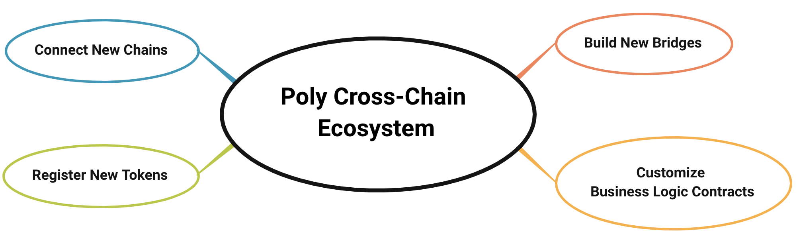

<h1 align="center">Guidelines for Reading</h1>

## Add New Chains
Please read this section if you want to connect your chain to poly:
- [Connect New Chains](new_chain/readme.md)

## Build New Bridges
Please read this section if you want to build a bridge using poly bridge sdk:
- [Build New Bridges](new_product/integrate_bridge/readme.md)

## Import New Assets
Please read this section if you want to import assets to the poly cross-chain ecosystem:
- [Import New Assets](new_product/integrate_assets/readme.md)

## Customize Business Logic Contracts

Please read this section if you want to deploy business contract:

- [Customize Business Logic Contracts](new_product/integrate_contracts/readme.md)

