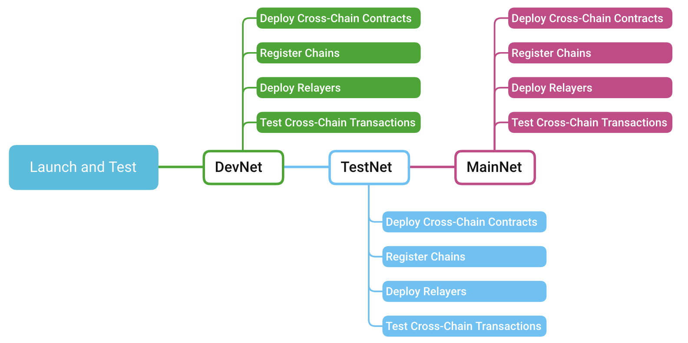

<h1 align="center">Launch and Test</h1>

Till now, you may have completed the above three parts and waiting to run your module. Then you can execute launch and test by following the listed steps according to the needs of your project.  

> [!NOTE]
> Typically, deployment and testing will always happen on test, dev, and mainnet in that order.

<div align=center></div>

## 1. Deploy Contracts

If you want to take templates provided by Poly as your CCM module, you need to deploy three contracts listed below:
- Deploy [Cross Chain Data contract](https://github.com/polynetwork/eth-contracts/blob/master/contracts/core/cross_chain_manager/data/EthCrossChainData.sol) and get the address of it.
- Deploy [Cross Chain Manager contract](https://github.com/polynetwork/eth-contracts/blob/master/contracts/core/cross_chain_manager/logic/EthCrossChainManager.sol) and input the address of Cross Chain Data contract.
- Deploy [Cross Chain Manager Proxy contract](https://github.com/polynetwork/eth-contracts/blob/master/contracts/core/cross_chain_manager/upgrade/EthCrossChainManagerProxy.sol) and input the address of Cross Chain Manager contract.

## 2. Register Chain

### Step 1. Call chain registration functions
Registration is the prerequisite of monitoring and processing block information and checking the execution of cross-chain transactions. The chain will be officially involved into the cross-chain ecosystem after completing registration and being approved by the Cross Chain Council.

- Call entry function `RegisterSideChain`
- Call entry function `ApproveRegisterSideChain`

> [!NOTE]
> Chain registration is currently completed by `poly team`  with the trusted account.

### Step 2. Call the genesis block header synchronize functions

Genesis block header synchronization is the prerequisite of synchronizing and processing the subsequent block header information. It involves Synchronizing the genesis block header of the new chain to poly chain and synchronizing the genesis header of the poly chain to ccm contract of the new chain.
- Call entry function `SyncSideChainGenesisHeader` 

> [!NOTE]
> Synchronization is currently completed by `poly team`  with the trusted account.


## 4. Deploy Relayers
Deployment of relayer involves two critical procedures: execute relayer subcommands below and deploy relayer. You can follow the listed commands and steps to complete your deployment. 
### Relayer Subcommands

- Execute `settxblock` to set the scan initial height.
  ```bash
  ./relayer_main settxblock --height 100210 --chain 7
  ```
- Execute`setheaderblock` to set the header sync height.
  ```bash
  ./relayer_main setheaderblock --height 100210 --chain 7
  ```
- Execute`status` to show the current relayer status.
  ```bash
  ./relayer_main status
  ```
  Sample output:
  ```
  Status Bsc:
  Latest node height: 16656699
  Latest sync height: 16656696
  Header sync height: 16656696
  Header mark height: 16656696
  tx listen height  : 16656682
  header sync height diff: 3
  tx listen height diff  : 17
  src tx queue size : 0
  poly tx queue size: 0
  ```

### Deployment steps:
Now you can actually deploy your relayer with the following three steps:
#### Step 1. Build the Binary

To build the binary, switch to the right branch [Branch Select](https://github.com/polynetwork/poly-relayer/blob/main/README.md#supported-chains), then run:


```bash
./build.sh devnet/testnet/mainnet
```


#### Step 2. Write the Configuration

* Make sure necessary configuration is specified in `config.json` [Sample](https://github.com/polynetwork/poly-relayer/blob/main/config.sample.json).

* Specify roles to enable in `roles.json` [Sample](https://github.com/polynetwork/poly-relayer/blob/main/roles.sample.json)


| Roles      | Quantity Demand                | Description                             |
| ---------- |--------------------------------| --------------------------------------- |
| HeaderSync | One or multiple for each chain | It submits chain headers to poly chain. |
| TxListen | Only one for each chain        | It observes cross chain transactions from source chain, and push them to message queue. |
| TxCommit | One or multiple for each chain | It consumes the message queue, and submit the cross chain transactions to poly. |
| PolyListen | Only One for poly chain        | It observes cross chain transactions from poly chain and push them to message queue. |
| PolyCommit | One or multiple for poly chain | It consumes the message queue, and submit the cross chain transaction to the destination chain. |

For Poly public nodes and contract addresses, check [here](Core_Smart_Contract/Contract/MainNet.md).

#### Step 3. Run the Relayer Process

Now call the command:

```
./server --config ./config.json --roles ./roles.json
```

> [!Note]
> - Check the wallet balance regularly to avoid problems caused by insufficient fee.
> 
> - You can create multiple accounts to accelerate message relay.
> 
> - Register a Poly chain wallet before run the relayer because the users are required to access with permission. 


## 5. Test

### Cross-chain using Lock proxy

### Cross-chain using Wrapper

