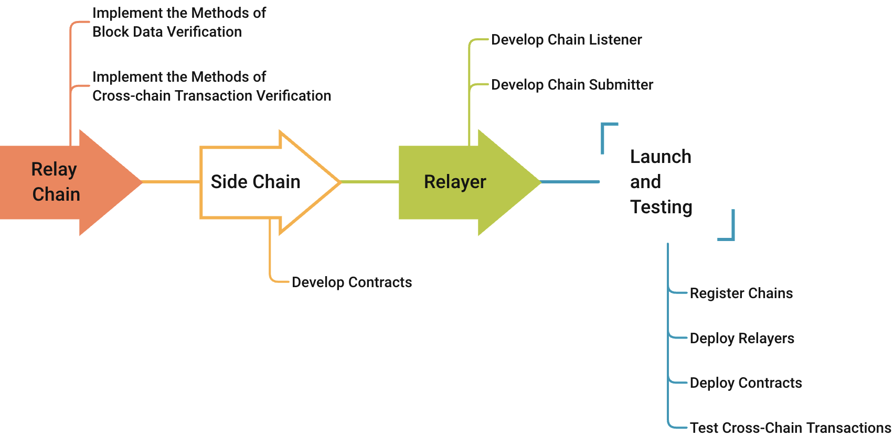

<h1 align="center">Connect New Chains to Poly Cross-Chain Ecosystem</h1>

If you want to **import a new chain** into Poly cross-chain ecosystem, this section will be the most helpful tutorial for you. Before that, in order to help you better understand the necessary procedures, a flow chart is provided here.  

