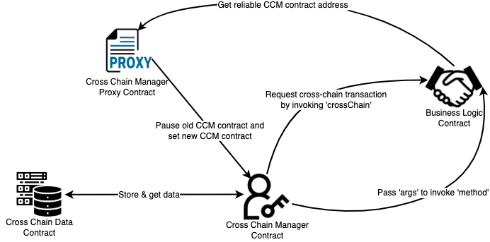

<h1 align="center">Develop for New Chain</h1>

The development of a new chain mainly involves developing cross-chain modules. Here, the cross-chain module works as a set of **smart contracts**. 

In some cases, it can also work as a native blockchain module. 
To help you develop it, here we offer examples in Solidity for each main method. 
You may refer to the complete [code](https://github.com/polynetwork/eth-contracts/blob/master/contracts/core/cross_chain_manager) of these contracts.

> [!Note|style:flat|label:Notice]
> If the chain integrated to Poly Network supports EVM, you could freely use our cross-chain contracts as templates. If not, you may need to develop your contracts that contain the main features as shown in the following guidelines. 

## 1. Introduction to Cross-chain Contracts
In this part, we sort the contracts into **data**, **logic**, and **proxy** contracts to complete the cross-chain contracts. You could either follow the methods listed below or choose other ways for your project.
- List of contracts: 
  - [Cross Chain Manager Contract](https://github.com/polynetwork/eth-contracts/blob/master/contracts/core/cross_chain_manager/logic/EthCrossChainManager.sol): On the source chain, it creates the cross-chain transactions transferred to the Poly. The target chain verifies the legitimacy of transactions and executes the method on the target business logic contract. It may be referred to as a CCM contract in the following context.
  - [Cross Chain Data Contract](https://github.com/polynetwork/eth-contracts/blob/master/contracts/core/cross_chain_manager/data/EthCrossChainData.sol): It serves as a database of cross-chain transactions. It may be referred to as a CCD contract in the following context.
  - [Cross Chain Manager Proxy Contract](https://github.com/polynetwork/eth-contracts/blob/master/contracts/core/cross_chain_manager/upgrade/EthCrossChainManagerProxy.sol): It serves as a proxy of the CCM contract. When there is any need to upgrade the CCM contract, it would pause the old CCM contract and set the new CCM contract to the CCD contract.
  - Business Logic Contract: It executes the business logic of cross-chain projects. It interacts with users and the CCM contract both on the source and target chains. We also offer the [guidelines](http://81.69.45.203/new_product/integrate_contracts/Customizing%20Business%20Logic%20Contract.html) for developing a Business Logic Contract.
- Interactions among contracts

<div align=center></div>

## 2. Developing CCM Contracts

Before customizing your CCM, you need to implement the four main features. 

### Step1. Synchronizing genesis block header

This step is meant to implement the methods of synchronizing the genesis block header of the Poly chain to the CCM contract. 

#### Example:

```solidity
/*  @notice                       Sync Poly chain genesis block header to smart contract
 *  @dev                          This function can only be called once; nextbookkeeper of rawHeader can't be empty
 *  @param rawHeader              Poly chain genesis block raw header or raw Header including switching consensus peers info
 *  @return                       true or false
*/
function initGenesisBlock(bytes memory rawHeader, bytes memory pubKeyList) whenNotPaused public returns(bool) {
    // Load Ethereum cross chain data contract
    IEthCrossChainData eccd = IEthCrossChainData(EthCrossChainDataAddress);
        
    // Make sure the contract has not been initialized before
    require(eccd.getCurEpochConPubKeyBytes().length == 0, "EthCrossChainData contract has already been initialized!");
        
    // Parse header and convit the public keys into nextBookKeeper and compare it with header.nextBookKeeper to verify the validity of signature
    ECCUtils.Header memory header = ECCUtils.deserializeHeader(rawHeader);
    (bytes20 nextBookKeeper, address[] memory keepers) = ECCUtils.verifyPubkey(pubKeyList);
    require(header.nextBookkeeper == nextBookKeeper, "NextBookers illegal");
        
    // Record current epoch start height and public keys (by storing them in address format)
    require(eccd.putCurEpochStartHeight(header.height), "Save Poly chain current epoch start height to Data contract failed!");
    require(eccd.putCurEpochConPubKeyBytes(ECCUtils.serializeKeepers(keepers)), "Save Poly chain current epoch book keepers to Data contract failed!");
        
    // Fire the event
    emit InitGenesisBlockEvent(header.height, rawHeader);
    return true;
}
```

- This method should be called initially and can **only** be called **once**. For the input data `rawHeader`, the `nextbookkeeper` can not be empty.
- Firstly, this function checks the **public key** of the current epoch to make sure that the CCM contract is uninitialized.  
- Then we will parse the raw header to get the `header.nextBookKeeper`. Comparing it with the `nextBookKeeper` converted from pubKeyList, we could verify the validity of the signature.
- After verifying the signature, we could record the current epoch start height and the public keys by storing them in the address format. And then emit the event `InitGenesisBlockEvent`.   

### Step2. Changing consensus validator

This step is meant to implement the methods of changing the Poly Chain consensus validator, which is called `BookKeeper` in the code. 

#### Example:

```solidity
/*  @notice                       change Poly chain consensus bookkeeper
 *  @param rawHeader              Poly chain change bookkeeper block raw header
 *  @param pubKeyList             Poly chain consensus nodes public key list
 *  @param sigList                Poly chain consensus nodes signature list
 *  @return                       true or false
*/
function changeBookKeeper(bytes memory rawHeader, bytes memory pubKeyList, bytes memory sigList) whenNotPaused public returns(bool) {
    // Load Ethereum cross chain data contract
    ECCUtils.Header memory header = ECCUtils.deserializeHeader(rawHeader);
    IEthCrossChainData eccd = IEthCrossChainData(EthCrossChainDataAddress);
        
    // Make sure rawHeader.height is higher than recorded current epoch start height
    uint64 curEpochStartHeight = eccd.getCurEpochStartHeight();
    require(header.height > curEpochStartHeight, "The height of header is lower than current epoch start height!");
        
    // Ensure the rawHeader is the key header including info of switching consensus peers by containing non-empty nextBookKeeper field
    require(header.nextBookkeeper != bytes20(0), "The nextBookKeeper of header is empty");
        
    // Verify signature of rawHeader comes from pubKeyList
    address[] memory polyChainBKs = ECCUtils.deserializeKeepers(eccd.getCurEpochConPubKeyBytes());
    uint n = polyChainBKs.length;
    require(ECCUtils.verifySig(rawHeader, sigList, polyChainBKs, n - (n - 1) / 3), "Verify signature failed!");
        
    // Convert pubKeyList into Ethereum address format and make sure the compound address from the converted Ethereum addresses
    // equals passed in header.nextBookKeeper
    (bytes20 nextBookKeeper, address[] memory keepers) = ECCUtils.verifyPubkey(pubKeyList);
    require(header.nextBookkeeper == nextBookKeeper, "NextBookers illegal");
        
    // update current epoch start height of Poly chain and current epoch consensus peers book keepers addresses
    require(eccd.putCurEpochStartHeight(header.height), "Save MC LatestHeight to Data contract failed!");
    require(eccd.putCurEpochConPubKeyBytes(ECCUtils.serializeKeepers(keepers)), "Save Poly chain book keepers bytes to Data contract failed!");
        
    // Fire the change book keeper event
    emit ChangeBookKeeperEvent(header.height, rawHeader);
    return true;
}
```

- Firstly, you need to make sure the `rawHeader.height` is higher than recorded current epoch starts height. 
- Then you need to ensure that the `rawHeader` is the key header, including info of switching consensus peers by containing a non-empty `nextBookKeeper` field.
- Analogous to `initGenesisBlock()`, we also need to parse the raw header to get the `header.nextBookKeeper`. Comparing it with the `nextBookKeeper` converted from pubKeyList, we could verify the validity of the signature.
- After verifying the signature, we could record the current epoch start height and current epoch consensus peers bookkeepers by storing them in the address format. And then emit the event `ChangeBookKeeperEvent`.   

### Step3. Pushing transactions

This step is meant to implement the methods of pushing the serialized cross-chain transaction information to the Poly chain.

#### Example:

````solidity
/*  
 *  @param toChainId              The target chain id
 *  @param toAddress              The address in bytes format to receive the same amount of tokens in the target chain
 *  @param toContract             Target smart contract address in bytes in the target blockchain
 *  @param txData                 Transaction data for target chain, include toAssetHash, toAddress, amount
 *  @return                       true or false 
*/
function crossChain(uint64 toChainId, bytes calldata toContract, bytes calldata method, bytes calldata txData) whenNotPaused external returns (bool) {
    // Only allow whitelist contract to call
    require(whiteListFromContract[msg.sender],"Invalid from contract");
        
    // Load Ethereum cross chain data contract
    IEthCrossChainData eccd = IEthCrossChainData(EthCrossChainDataAddress);
        
    // To help differentiate two txs, the ethTxHashIndex is increasing automatically
    uint256 txHashIndex = eccd.getEthTxHashIndex();
        
    // Convert the uint256 into bytes
    bytes memory paramTxHash = Utils.uint256ToBytes(txHashIndex);
        
    // Construct the makeTxParam, and put the hash info storage, proving tx existence
    bytes memory rawParam = abi.encodePacked(ZeroCopySink.WriteVarBytes(paramTxHash),
        ZeroCopySink.WriteVarBytes(abi.encodePacked(sha256(abi.encodePacked(address(this), paramTxHash)))),
        ZeroCopySink.WriteVarBytes(Utils.addressToBytes(msg.sender)),
        ZeroCopySink.WriteUint64(toChainId),
        ZeroCopySink.WriteVarBytes(toContract),
        ZeroCopySink.WriteVarBytes(method),
        ZeroCopySink.WriteVarBytes(txData)
    );
        
    // Must save it in the storage to be included in the proof to be verified.
    require(eccd.putEthTxHash(keccak256(rawParam)), "Save ethTxHash by index to Data contract failed!");
        
    // Fire the cross chain event denoting there is a cross chain request from Ethereum network to other public chains through Poly chain network
    emit CrossChainEvent(tx.origin, paramTxHash, msg.sender, toChainId, toContract, rawParam);
    return true;
}
````

- Only the contracts in the **whitelist** can call this method.
- When a cross-chain function is carried out interact, it creates cross-chain transactions invoked by service contracts the logic cont.
- This method constructs the `rawParam`, which contains **transaction hash**, `msg.sender`, **target chain ID**, **business logic contract** to be invoked on target chain, the **target method** to be invoked, and the **serialized transaction data** which has been already constructed in the business logic contract. 
- Then put the hash of `rawParam` into storage, proving the existence of the transaction.

### Step4. Verifying & executing

This step is meant to implement the methods of verifying the block header and Merkle proof. If passing the verification, the transaction could be executed on the target chain.

#### Example:

````solidity
/*  
 *  @param proof                  Poly chain transaction Merkle proof
 *  @param rawHeader              The header containing crossStateRoot to verify the above tx Merkle proof
 *  @param headerProof            The header Merkle proof used to verify rawHeader
 *  @param curRawHeader           Any header in current epoch consensus of Poly chain
 *  @param headerSig              The converted signature variable for solidity derived from Poly chain consensus nodes' signature 
 *                                used to verify the validity of curRawHeader
 *  @return                       true or false
*/
function verifyHeaderAndExecuteTx(bytes memory proof, bytes memory rawHeader, bytes memory headerProof, bytes memory curRawHeader,bytes memory headerSig) whenNotPaused public returns (bool){
    ECCUtils.Header memory header = ECCUtils.deserializeHeader(rawHeader);
    // Load ehereum cross chain data contract
    IEthCrossChainData eccd = IEthCrossChainData(EthCrossChainDataAddress);
        
    // Get stored consensus public key bytes of current poly chain epoch and deserialize Poly chain consensus public key bytes to address[]
    address[] memory polyChainBKs = ECCUtils.deserializeKeepers(eccd.getCurEpochConPubKeyBytes());

    uint256 curEpochStartHeight = eccd.getCurEpochStartHeight();

    uint n = polyChainBKs.length;
    if (header.height >= curEpochStartHeight) {
        // It's enough to verify rawHeader signature
        require(ECCUtils.verifySig(rawHeader, headerSig, polyChainBKs, n - ( n - 1) / 3), "Verify poly chain header signature failed!");
    } else {
        // We need to verify the signature of curHeader 
        require(ECCUtils.verifySig(curRawHeader, headerSig, polyChainBKs, n - ( n - 1) / 3), "Verify poly chain current epoch header signature failed!");

        // Then use curHeader.StateRoot and headerProof to verify rawHeader.CrossStateRoot
        ECCUtils.Header memory curHeader = ECCUtils.deserializeHeader(curRawHeader);
        bytes memory proveValue = ECCUtils.MerkleProve(headerProof, curHeader.blockRoot);
        require(ECCUtils.getHeaderHash(rawHeader) == Utils.bytesToBytes32(proveValue), "verify header proof failed!");
    }
        
    // Through rawHeader.CrossStatesRoot, the toMerkleValue or cross chain msg can be verified and parsed from proof
    bytes memory toMerkleValueBs = ECCUtils.MerkleProve(proof, header.crossStatesRoot);
        
    // Parse the toMerkleValue struct and make sure the tx has not been processed, then mark this tx as processed
    ECCUtils.ToMerkleValue memory toMerkleValue = ECCUtils.deserializeMerkleValue(toMerkleValueBs);
    require(!eccd.checkIfFromChainTxExist(toMerkleValue.fromChainID, Utils.bytesToBytes32(toMerkleValue.txHash)), "the transaction has been executed!");
    require(eccd.markFromChainTxExist(toMerkleValue.fromChainID, Utils.bytesToBytes32(toMerkleValue.txHash)), "Save crosschain tx exist failed!");
        
    // Ethereum ChainId is 2, we need to check the transaction is for Ethereum network
    require(toMerkleValue.makeTxParam.toChainId == chainId, "This Tx is not aiming at this network!");
        
    // Obtain the target contract, so that Ethereum cross chain manager contract can trigger the executation of cross chain tx on Ethereum side
    address toContract = Utils.bytesToAddress(toMerkleValue.makeTxParam.toContract);
        
    // only invoke PreWhiteListed Contract and method For Now
    require(whiteListContractMethodMap[toContract][toMerkleValue.makeTxParam.method],"Invalid to contract or method");

    //TODO: check this part to make sure we commit the next line when doing local net UT test
    require(_executeCrossChainTx(toContract, toMerkleValue.makeTxParam.method, toMerkleValue.makeTxParam.args, toMerkleValue.makeTxParam.fromContract, toMerkleValue.fromChainID), "Execute CrossChain Tx failed!");

    // Fire the cross chain event denoting the executation of cross chain tx is successful,
    // and this tx is coming from other public chains to current Ethereum network
    emit VerifyHeaderAndExecuteTxEvent(toMerkleValue.fromChainID, toMerkleValue.makeTxParam.toContract, toMerkleValue.txHash, toMerkleValue.makeTxParam.txHash);

    return true;
}

/* 
 *  @notice                       Dynamically invoke the target contract, trigger execution of cross-chain tx 
                                  on Ethereum side
 *  @param _toContract            the Ethereum Cross Chain Manager contract will invoke the target contract
 *  @param _method                At which method will be invoked within the target contract
 *  @param _args                  The parameter that will be passed into the target contract
 *  @param _fromContractAddr      From chain smart contract address
 *  @param _fromChainId           Indicate from which chain current cross-chain tx comes 
 *  @return                       true or false
*/
function _executeCrossChainTx(address _toContract, bytes memory _method, bytes memory _args, bytes memory _fromContractAddr, uint64 _fromChainId) internal returns (bool){
    // Ensure the target contract gonna be invoked is indeed a contract rather than a normal account address
    require(Utils.isContract(_toContract), "The passed in address is not a contract!");
    bytes memory returnData;
    bool success;
        
    // The returnData will be bytes32, the last byte must be 01;
    (success, returnData) = _toContract.call(abi.encodePacked(bytes4(keccak256(abi.encodePacked(_method, "(bytes,bytes,uint64)"))), abi.encode(_args, _fromContractAddr, _fromChainId)));
        
    // Ensure the executation is successful
    require(success == true, "EthCrossChain call business contract failed");
        
    // Ensure the returned value is true
    require(returnData.length != 0, "No return value from business contract!");
    (bool res,) = ZeroCopySource.NextBool(returnData, 31);
    require(res == true, "EthCrossChain call business contract return is not true");
        
    return true;
}
````

- The relayer should invoke this method. In some cases, users could invoke this method by themselves if they get the valid block information from Poly. 
- This method fetches and processes **cross-chain transactions**, finds the **Merkle root of a transaction** based on the block height (in the block header), and verifies the **transaction's legitimacy** using the transaction parameters.
- After verifying the Poly chain block header and proof, you still need to check if the parameters `toContract` and `toMerkleValue.makeTxParam.method` have been listed in whitelists.
- Then it will invoke the business logic contract deployed on the target chain. Invoking will be processed through the internal method `_executeCrossChainTx()`: 
  - This method is meant to invoke the target contract and trigger the execution of cross-chain tx on the target chain. 
  - Firstly, you need to ensure that the target contract is waiting to be invoked a contract rather than a standard account address. 
  - Then construct a target business logic contract method:  you need to `encodePacked` the `_method` and the input data format `"(bytes,bytes,uint64)"`. 
  - Then it would `keccak256` the encoded string, using `bytes4` to take the first four bytes of the call data for a function call specifies the function to be called. 
  - Parameter `_method` is from the `toMerkleValue`, which is parsed from `proof`. And the input parameters format is restricted as (bytes `_args`, bytes `_fromContractAddr`, uint64 `_fromChainId`). These two parts are encodePacked as a method call.  
- After calling the method, you need to check the return value. Only if the return value is true will the whole cross-chain transaction be executed successfully. 


To guarantee the safety of the CCM contract, we keep **whitelists** of contract addresses and methods to prevent invalid calls. Meanwhile, we also set `whiteLister` to manage these whitelists of the CCM contract. 

Here is the [template](https://github.com/polynetwork/eth-contracts/blob/master/contracts/core/cross_chain_manager/logic/EthCrossChainManager.sol#41) for adding a whitelist. We highly encourage developers to develop similar features of authority management in personal projects. 
