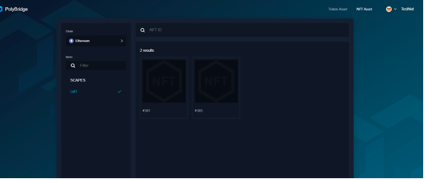
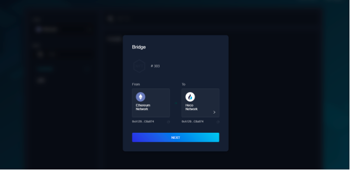
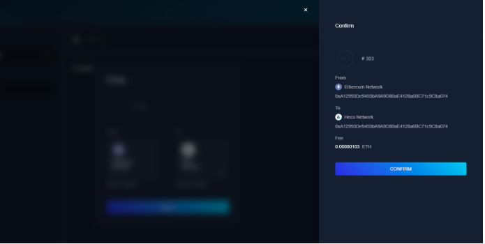
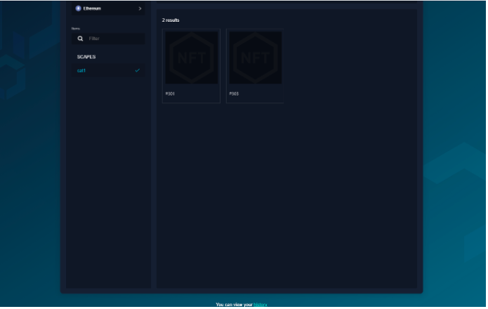

<h1 align="center">Import NFT</h1>

##1. Import NFT Steps
### Step1. Provide contract address
- In most cases the project party only needs to deploy a version of the NFT contract on the source chain, and Poly Network will deploy the NFT proxy contract on the destination chain.
- The source NFT contract must support the EIP-721 standard *https://eips.ethereum.org/EIPS/eip-721*. It should be noted here that the EIP-721 standard does not include the mint method. In our cross-chain process, when the newly generated asset on the source chain is transferred from one chain to another, Poly will determine if there is this asset in the target contract. If not, a new NFT will be minted.
- Poly Network provides this NFT template: *https://github.com/polynetwork/nft-contracts/tree/main/contracts/erc721_template*.
    - This contract implements minting interface using the Poly Network standard:
      `function mintWithURI(address to, uint256 tokenId, string memory uri) external`
    - This method will be called in Poly Network’s PolyNFTLockProxy contract.
    - If the project party team wants to deploy the NFT contract on the target chain by themself, please make sure to implement the above interface and ensure that the method name, parameters, and order are strictly consistent.
    - If the project party’s contract does not implement `_safeMint`, `_setTokenURI`, etc. methods, the team needs to implement it itself. If you have implemented these methods, you can directly copy the following code:
    
  ```solidity 
  function mintWithURI(address to, uint256 tokenId, string memory uri) external {
  require(!_exists(tokenId), “token id already exist”);
  _safeMint(to, tokenId);
  _setTokenURI(tokenId, uri);
  }
  ```
### Step2. Provide baseUri
- e.g: https://api.seascape.network/nft/metadata/

### Step3. Provide standards file according to the requirements above
```json
{
“Name”:”SCAPES”,
“BaseURI”:”https://api.seascape.network/nft/metadata/",
“Assets”:[
{
“ChainName”:”eth”,
“Address”:”0x3680fb34F55030326659cd9AaEc522B6E355bdB6"
},
{
“ChainName”:”bsc”,
“Address”:”0x66638F4970C2ae63773946906922c07a583b6069"
},
{
“ChainName”:”heco”,
“Address”:”0xF9Dd424e64E9264632a564FBDcC87Ba8eA40B5Ba”
}
]
}
```

### Step4. Provide NFT profile data format and query interface 
- The query interface should include single query and batch query. This step is not required.

### Step5. Connect Poly Network
- Contact the poly administrator at TG: *https://t.me/joinchat/Hjv5NBrfO1C2LyODQfxVDw*

##2. NFT Bridge User Manual
### Step1. Opening the NFT page and connecting to the wallet
- Address: *https://bridge.poly.network/nft*
- Start: Click on “NFT Asset” to enter the main page. If a wallet is not connected, all existing NFT assets will be displayed.
- Click “connect Wallet” button in the top right-hand corner and connect to the wallet.
<div align=center></div>
 
  > [!NOTE]
  > if the user has not connected any wallet, clicking on any NFT image will open the wallet connection page. A wallet must be connected at this step, the page looks as below:
<div align=center></div>
  
  > [!NOTE]
  > if the selected chain does not match the currently active chain in Metamask, the following error will occur. In this case the chain in the wallet needs to be switched to the one selected in the Bridge.
<div align=center></div>

### Step2. Making an NFT cross-chain transaction
- After connecting to the wallet, the page will display the NFT assets owned by the user on the corresponding chain.
- See ETH to HECO cross-chain transaction as an example on the screenshot below:
<div align=center></div>
<div align=center></div>

- When making a cross-chain transaction for the first time, click “Approve” to verify.
<div align=center></div>

- After successfully approved, click “Next”.
<div align=center></div>

- On the transaction confirmation page， the cross-chain bridge will charge the corresponding fee.
<div align=center></div>

- Next you can view the progress of the cross-chain transfer. Click on the transaction hash to open it in the Poly Network Browser (https://explorer.poly.network).

### Step3. Query NFT transaction history
- Click the history “button” at the bottom of the page to view data on the history page.
<div align=center></div>
<div align=center></div>
