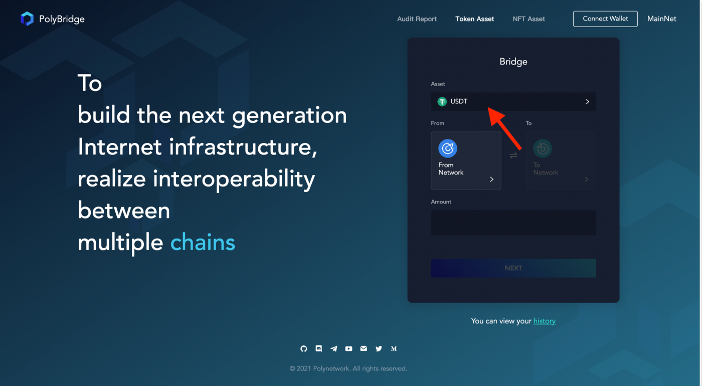
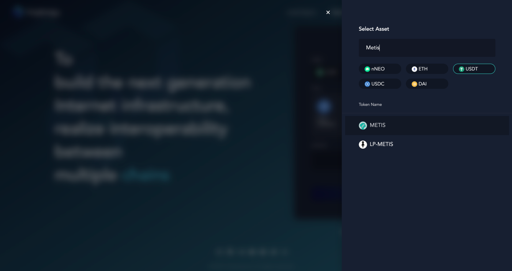
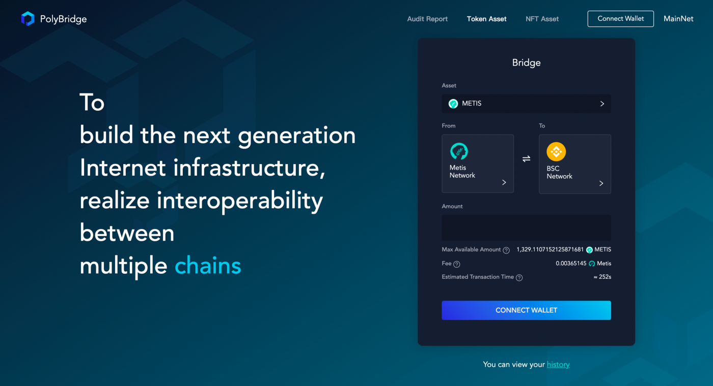
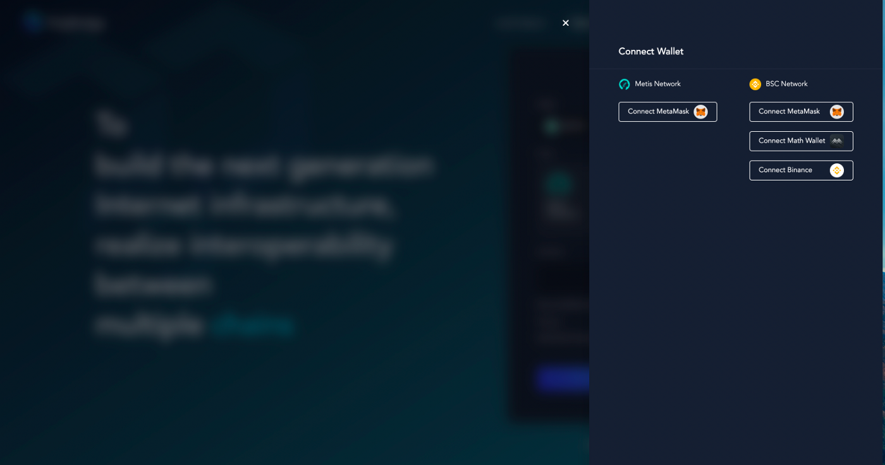
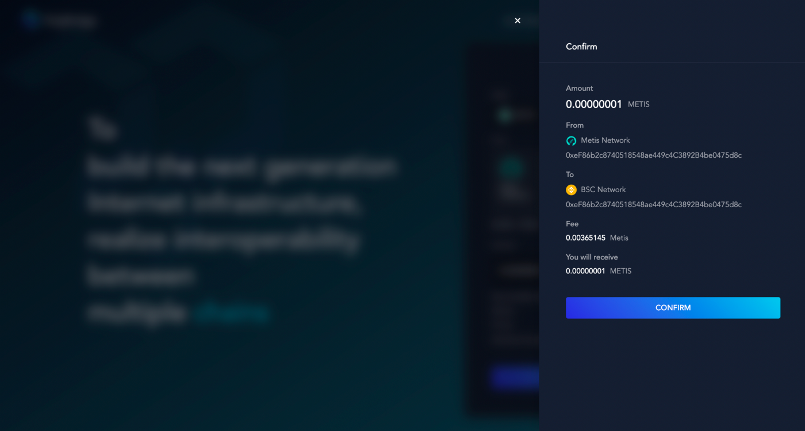

<h1 align="center">Import token</h1>

##1. Import Token Steps
### Step1. Deploy a corresponding asset
- Use the *https://github.com/polynetwork/eth-contracts/blob/master/contracts/core/assets/erc20_template/ERC20Template.sol* template to deploy a corresponding asset mapping contract on target chain, the total amount needs to be consistent with the amount on the source chain.

### Step2. Transfer assets
- Transfer the initialized assets to the target chain proxy [contract](../../Core_Smart_Contract/Contract/TestNet.md).

### Step3. Download template excel
- [Download](http://81.69.45.203/new_product/integrate_assets/resources/import_asset_template.xlsx) the asset template of Poly Network.
- Fill in the asset information according to eg in excel.

### Step4. Connect Poly Network
- Contact the poly administrator at TG: *https://t.me/joinchat/Hjv5NBrfO1C2LyODQfxVDw*
- Send asset excel.

### Step5. Wait to import
   - Wait for the operator to add the contract address to the whitelist, then you can visit: https://bridge.poly.network/testnet to complete the cross-chain transfer from the source chain to target chain.

##2. Poly Bridge Personal Computer User Manual
> [!NOTE]
> the token $METIS will be taken as the example in this document.
### Step1. Select asset
- Firstly, you need to select the token you want to transfer. As shown in Figure 1, click “Asset”, then you can choose the token in the pop-window.

### Step2. Select network
- After asset selection, click “From Network”, choose the source network which the chosen token located in the pop window. Select the target network in the same way.
  > [!NOTE]
  > the optional network shown in the picture is the network type supported by $METIS. The network should be switched according to different assets. Please choose it according to the situation.

- The example that $METIS be sent from Andromeda to the target network BSC is shown in picture.

### Step3. Connect wallet
- Next, you can connect your wallet by clicking the button “Connect Wallet”at the bottom of the page or up right in the corner. After clicking, you can choose which wallet to be connected to the source or the target network.

  > [!NOTE]
  > different networks support different wallet, the current support status is shown in table.

  > [!NOTE]
  > when there is a red alert “Please switch network”, you need to switch the network of wallet to keep consistent with the source network.

### Step4. Submit transaction
- Enter input token value, then click “Next”. A pop window will appear to show the details of the transaction. Please check carefully. If you make sure the transaction information is correct, then click “Confirm”button to submit the transaction and confirm it in wallet again.
  > [!NOTE]
  > if you are the first time to swap, an approval operation is required before you submit transaction, (Approve Infinity or not according to your actual situation).

### Step5. View the results
- After the submission, you can view the transaction result through “History”. When the transaction details are displayed, it means that the transaction is completed.

 
  > [!NOTE]
  > The processing time of Poly Network Swaps are determined by the amount of the transaction fee. In order to avoid network congestion, Poly Network defaults to the maximum gas fee which will be used as the transaction fee on the source chain. Poly Network itself does not charge any gas fee.

