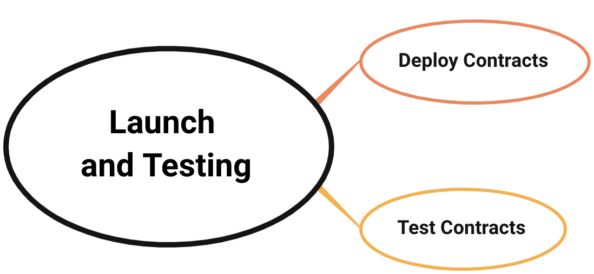

<h1 align="center">Launch and Test</h1>

## 1. Deploying Contracts

To implement cross chain features, you need to make sure that:

- The customized business logic contracts are deployed both on source chain and target chain
- The cross chain methods in your business logic contracts have authorized our Cross Chain Manager Contract to call. 
- The mapping assets need to be bound before any cross chain transactions

## 2. Test Your Contracts

We highly encourage project developers to test the business logic contract on testnet before launching on mainnet. 
If you want to test your contract on mainnet directly, you need to provide us with the **business logic contract addresses** and **cross-chain methods** both on source chain and target chain, so that we could maintain the whitelist of CCM contract, which is meant to guarantee the safety of cross chain process.

Following are the tests required to be done before launching project:
