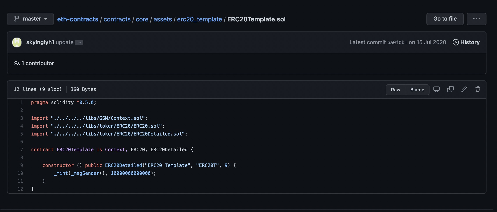

<h1 align="center">ADD TOKEN</h1>

在跨链之前,项目方已经有了token,并且该token需要跨的链poly已经支持.
1. Use the *https://github.com/polynetwork/eth-contracts/blob/master/contracts/core/assets/erc20_template/ERC20Template.sol* template to deploy a corresponding asset mapping contract on other chain, the total amount needs to be consistent with the amount on the source chain;
    <div align=center></div>

2. Transfer the initialized assets to the destination proxy contract. The testnet contract address:
*https://github.com/polynetwork/docs/blob/master/config/README_TestNet.md*

3. Send the source chain and destination chain asset contract address to Poly Network staff operator, contact: *https://t.me/joinchat/Hjv5NBrfO1C2LyODQfxVDw*

    Provide standards file according to the requirements above 
   e.g:
   ```
	    {
	    “Name”:”SCAPES”,
	    “URI”:”",
	    “Assets”:[
	    {
	    “ChainName”:”eth”,
	    “Address”:”0x3680fb34F55030326659cd9AaEc522B6E355bdB6"
	    },
	    {
	    “ChainName”:”bsc”,
	    “Address”:”0x66638F4970C2ae63773946906922c07a583b6069"
	    },
	    {
	    “ChainName”:”heco”,
	    “Address”:”0xF9Dd424e64E9264632a564FBDcC87Ba8eA40B5Ba”
     }
     ]
     }
    ```
4. Wait for the operator to add the contract address to the whitelist and bind asset to proxy contract then you can visit: *https://bridge.poly.network/testnet* to complete the cross-chain transfer from the source chain to destination chain.
    <div align=center></div>